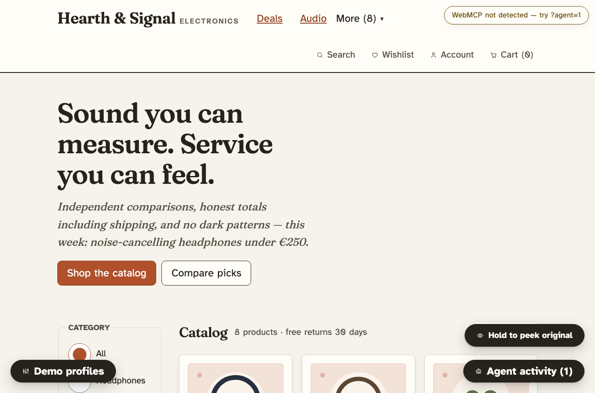

# As I Am

**The web adapts. You don't have to.**

One private preference profile. Every participating website adapts.

As I Am is a working demo of the **Adaptive Web Contract v0.1** for the OpenAI WebMCP
Challenge 2026: a personal agent holds what it knows about a person; websites expose what
they can adapt over WebMCP; the agent sends **functional preferences only** — never a
diagnosis — and the website applies them, *measures the rendered result*, and lets the
agent refine, undo and verify.

## The proof in one loop

| Before (normal shop) | After (agent applied a functional profile) |
| --- | --- |
| 10 nav items, icon-only controls, ticker, promos, dense text | 3 primary actions, visible labels, no motion, 150–180% text, prices emphasized, 52px targets |



**Reproduce it (one prompt):**

> "I have low vision, a hand tremor, and I lose track of multi-step tasks. Make this page
> comfortable for me, but do not send my diagnoses to the website."

The agent calls `get_adaptation_capabilities`, `apply_adaptation_profile`,
`measure_rendered_ui`. Then say:

> "The text is still too small, especially the prices."

The agent raises only the relevant text categories via `tune_visual_presentation`,
re-measures with `measure_rendered_ui`, and reports the actual rendered pixel sizes back.

## Live

- **Demo:** *(deploy target — see below; locally: `npm run dev` → http://localhost:5173)*
- Works fully without WebMCP: every tool is also runnable in the built-in dev harness at **`?agent=1`**.

## Privacy model (why this is different)

- **No diagnosis parameters exist in any tool schema.** The contract has no field for them.
- Tool arguments are **scanned and rejected** if they contain diagnosis-like terms.
- The tool log shows functional parameters only (tested).
- Nothing is persisted: session memory only — no cookies, no localStorage, no analytics,
  no third-party requests, no profile values in URLs.
- Every page shows transparently **which functional values it received** (see the demo panel).
- Export is a **diagnosis-free functional receipt** (`export_adaptation_receipt`) the agent
  carries to the next participating website.
- Risky actions always need explicit human confirmation in the page; every adaptation is undoable.

Details: [docs/privacy-model.md](docs/privacy-model.md)

## Why WebMCP

A website cannot magically restyle itself for one person, and a person cannot configure
every site again and again. WebMCP gives the *website* a standard way to expose what it can
adapt (capability discovery), what it is (`explain_page`), what tasks it offers
(`list_available_tasks`) and what actually happened after an adaptation (real measurements) —
and gives the *agent* a standard way to negotiate. No CSS selectors cross the boundary;
sites translate semantic preferences into their own design tokens.

Accessibility becomes a live negotiation between a person, their agent and the website —
not a static settings panel.

## Tools (31)

**Universal adaptation (15):** `get_adaptation_capabilities`, `get_adaptation_state`,
`apply_adaptation_profile`, `adapt_for_task`, `tune_visual_presentation`,
`tune_interaction`, `tune_cognitive_support`, `tune_motion_and_media`, `set_reading_mode`,
`measure_rendered_ui`, `verify_profile_fit`, `undo_adaptation`, `reset_adaptations`,
`explain_adaptation`, `export_adaptation_receipt`

**Semantic page tools (5):** `explain_page`, `list_available_tasks`, `summarize_content`,
`read_content` (optional local TTS), `focus_task`

**Demo domain tools (11):** `search_products`, `filter_products`, `get_product_details`,
`compare_products`, `explain_price`, `calculate_total_cost`, `find_available_coupons`,
`apply_coupon`, `read_comparison`, `prepare_cart_change` (staged; human-confirmed),
`undo_cart_change`

Full reference with schemas: [docs/tool-reference.md](docs/tool-reference.md)

## Run locally

```bash
npm install
npm run dev        # http://localhost:5173
```

Routes: `/` (pitch) · `/shop` (electronics comparison shop) · `/services` (city resident portal).

**With a real agent:** Chrome 149+ and `chrome://flags/#enable-webmcp-testing` enabled.
The page registers all 31 tools via `document.modelContext.registerTool(...)`.

**Without WebMCP:** the page says so honestly and stays fully usable; append `?agent=1`
for the tool harness (same handlers the WebMCP bridge uses).

## Tests

```bash
npm run typecheck     # TypeScript
npm test              # 43 unit tests (contract, merging, privacy, price math, tool smoke)
npm run test:e2e      # 16 Playwright tests (demo loop, portability, axe, keyboard, WebMCP shim)
npm run build         # production build
```

Covered among others: the Demo-1 loop (apply → refine → measure → undo), the same profile
working on **both** sites, receipt portability, diagnosis-term rejection, zero
serious/critical axe violations in normal *and* adapted views, keyboard-only operation,
reduced-motion, colour-independent status rendering, and WebMCP registration against a
faithful `document.modelContext` shim.

## Known limits (honest)

- Websites must implement the contract; no magic restyling of arbitrary sites.
- WebMCP complements semantic HTML/WCAG/assistive tech — it never replaces them.
- The agent simulator in the demo panel is a stand-in for a real personal agent.
- Read-aloud uses the local Web Speech API (browser-dependent); a text alternative always exists.
- Ticker/carousel autoplay exists in the *normal* view on purpose — the demo shows it being removed.

More: [docs/accessibility-model.md](docs/accessibility-model.md) ·
[docs/adaptive-web-contract.md](docs/adaptive-web-contract.md) ·
[docs/demo-script.md](docs/demo-script.md) · [docs/architecture.md](docs/architecture.md)

## License

MIT — see [LICENSE](LICENSE). All data is synthetic; no real purchases, accounts or tracking.
