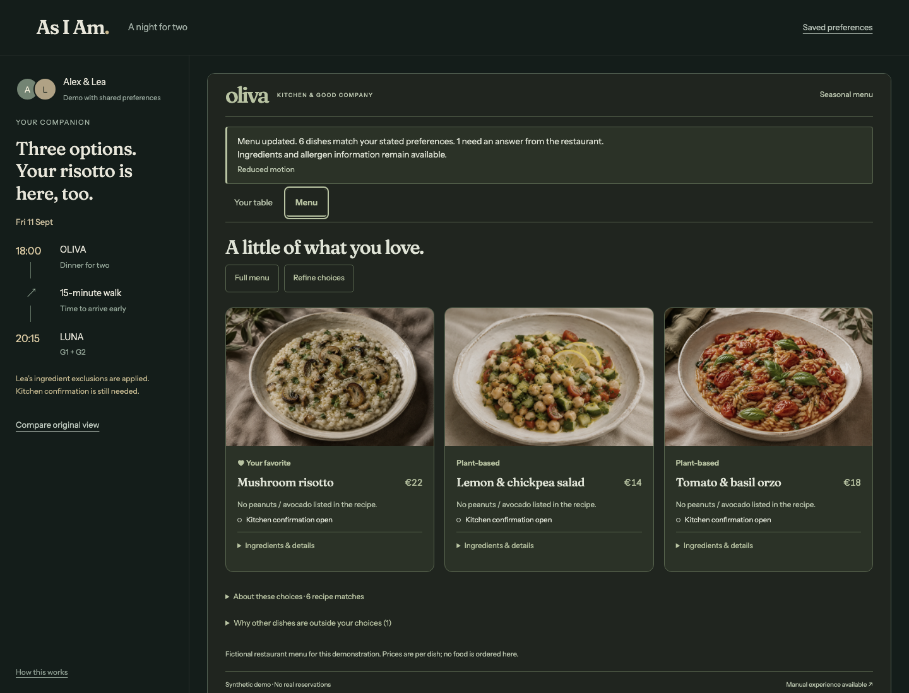

# As I Am

**The web adapts. You don’t have to.**

As I Am explores a web where your agent can ask a website to meet your access needs,
then help you use it. The website changes its own controls and layout. You can
inspect the result, change your mind and keep the final say.

The demo is an ordinary evening: **a film and dinner for two**. Alex wants a calmer
screen today and an aisle seat beside Lea. The agent uses preferences they have
chosen to share, finds two suitable seats, makes room for dinner before the film,
and brings three relevant dishes into view. Alex’s favorite risotto is there;
Lea’s peanut and avocado exclusions remain visible, along with questions for the kitchen.



[Watch the 80-second demo](https://youtu.be/r40L1yJhNyc) · [Try it](https://asiam.wernerverse.de/) · [Judge walkthrough](docs/judge-testing.md)

The hosted demo uses the jury login supplied privately with the submission. Anyone
can run the same app locally without an account, payment or API key.

## Try it locally

Requires Node.js 22 or later.

```bash
npm ci
npm run dev
```

Open **http://localhost:5273/** and choose **Plan our evening**. Try **One row further
back**, review the seats and confirm the demo tickets. Continue to dinner, inspect
the dishes, then review the table. Both confirmations stay with you.

The launcher needs ports 5273–5275. It runs the companion, cinema and restaurant on
separate local origins. The hosted version uses separate pages on one HTTPS origin.

| Page | Local URL | Hosted path |
| --- | --- | --- |
| A night for two | `http://localhost:5273/` | `/` |
| More access choices | `http://localhost:5273/guided` | `/guided` |
| LUNA Cinema | `http://localhost:5274/cinema` | `/cinema` |
| OLIVA Restaurant | `http://localhost:5275/restaurant` | `/restaurant` |

## Why WebMCP

The agent works with the website’s own tools. It can discover supported changes,
apply a profile, measure the rendered result and carry the supported display
preferences to another participating page. It can also research seats, meal times
and ingredients, or prepare a booking for review. **Final booking confirmation stays with the person.**

For example, a person can request dark appearance, lower glare and stopped
animations without sending the website a diagnosis:

```json
{
  "profile": {
    "version": "0.1",
    "visual": { "color_scheme": "dark", "glare": "low" },
    "motion_media": { "reduce_motion": true, "disable_animation": true }
  }
}
```

An external agent passes this to `apply_adaptation_profile`, then checks
`measure_rendered_ui` and `verify_profile_fit`. The `/guided` experience also offers
larger controls, more readable text and fewer competing choices. Adaptations keep
the current selection intact.

The registration is in [src/webmcp/register.ts](src/webmcp/register.ts). See the
[tool reference](docs/tool-reference.md), [schemas and contract](docs/adaptive-web-contract.md)
and [native agent walkthrough](docs/judge-testing.md#native-external-agent-walkthrough).
Use a WebMCP-capable browser and open the cinema and restaurant as top-level pages
for native tool discovery. The manual walkthrough works in an ordinary browser too.

## Scope and limits

Alex and Lea, their saved context, menu and bookings are fictional. The home
walkthrough runs labelled presets; it does not contain a language model or a
production memory service. Real external agents can discover and call the native
page tools. The optional demo bridge is labelled separately.

This contract is for websites that implement it. It does not restyle arbitrary
sites. The display receipt contains functional preferences, not names, diagnoses,
allergies or booking details. Food requirements and film times are separate task
inputs. [Privacy and data boundaries](docs/privacy-model.md)

Calm settings are a personal preference, not a treatment. A recipe match is not an
allergy-safety guarantee: missing ingredients and cross-contact still need kitchen
confirmation. Our checks verify software behavior and rendered properties; work
with disabled participants is still needed. [Inclusion evidence](docs/inclusion-evidence.md)

## Build and contribute

```bash
npm run build                  # static output in dist/
npx playwright install chromium
npm run check                  # types, unit, recorder and browser tests, build
```

Serve `dist/` with a fallback to `index.html` for page routes. No application server
or database is needed. [Hosting notes](docs/hosting.md) cover the deployed Netcup
setup; Netlify and Vercel configurations are included as alternatives.

Contributions are welcome. Describe the access need or behavior you want to improve,
keep changes focused, and run the relevant checks. Preserve the person’s selections,
consent and ability to undo presentation changes. [Architecture](docs/architecture.md)
and [verification](docs/verification.md) explain the implementation and existing evidence.

## Demo and license

The [79.6-second demo film](https://youtu.be/r40L1yJhNyc) has English narration and subtitles.
The screenshots above and [cinema view](docs/screenshots/cinema-calm.png) were captured
from the deployed application. Earlier shop and services examples remain under
`/legacy`, `/shop` and `/services`; historical screenshots remain in `docs/screenshots/`.

Built during the WebMCP Challenge submission period with React, TypeScript, Vite
and locally hosted fonts. Code and generated demo artwork are [MIT licensed](LICENSE).
Bundled fonts retain
their [original notices](public/third-party-licenses.txt); generated demo artwork
and voice provenance are documented in [art direction](docs/art-direction.md) and
[the recording notes](docs/recording.md).
